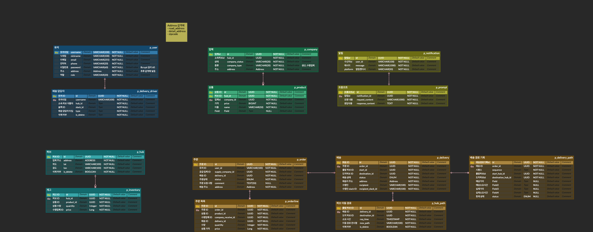
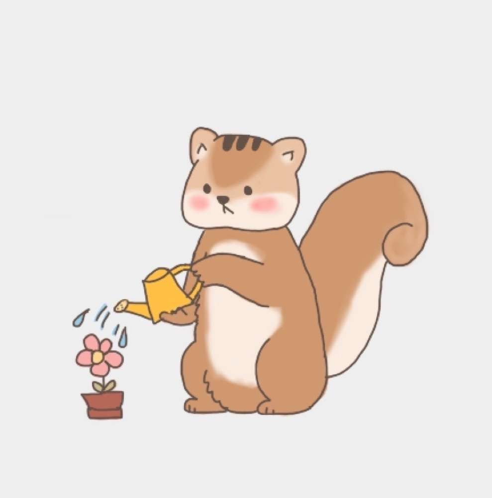

# 🐿 animal-logistics

> 👊 Ch.4 동물농장 팀 (9조) - 물류 서비스 프로젝트

## 목차

- [🐥 컨벤션 가이드](#-컨벤션-가이드)
- [🐶 템플릿 사용 방법](#-템플릿-사용-방법)
- [🐸 실행 방법](#-실행-방법)
- [🐹 개발 환경](#-개발-환경)
- [👻 상세 개발 환경](#-상세-개발-환경)
- [🐰 프로젝트 상세](#-프로젝트-상세)
- [🐳 ERD](#-erd)
- [🐙 API docs](#-api-docs)
- [🐬 인프라 구조](#-인프라-구조)

## 🐥 컨벤션 가이드

- [여기](./conventions)를 참고해주세요.

## 🐸 실행 방법

1. 아래의 환경 변수 설정
    ```dotenv
   
    ```
    - `구성 편집` -> `빌드 및 실행` -> `옵션 수정` -> `환경 변수` 선택 -> 환경 변수에 아래의 형식으로 작성
    - `키1=값1;키2=값2`
2. 프로젝트에 맞게 [docker-compose.yml](./docker-compose.yml) 수정
3. 도커 실행
4. 애플리케이션 모듈의 스프링 실행
    - `docker compose support` 라이브러리가 자동으로 컨테이너를 실행 및 종료합니다.

## 🐹 개발 환경

| 분류         | 상세                                  |
|------------|:------------------------------------|
| IDE        | IntelliJ                            |
| Language   | Java 17                             |
| Framework  | Spring Boot 3.3.3                   |
| Repository | PostgreSQL 16.4, H2 In-memory(Test) |
| Build Tool | Gradle 8.8                          |
| Infra      | EC2, Docker, Github Actions         |

## 👻 상세 개발 환경

### Dependencies

- Spring WebMVC
- Spring Validation
- Spring Security
- Spring Data Jpa
- Spring Data Redis
- jjwt 0.12.5
- QueryDSL 5.0.0
- mapStruct 1.5.5.Final
- Lombok
- JUnit
- Swagger 2.6.0
- Jacoco

## 🐰 프로젝트 상세

> 여기에 프로젝트 상세 소개를 작성하시면 됩니다.

## 🐳 ERD



- [ErdCloud](https://www.erdcloud.com/d/3PmxD7wzwzgkzgrib)

## 🐙 API docs

- [Swagger UI](https://www.google.co.kr/)

## 🐬 인프라 구조


