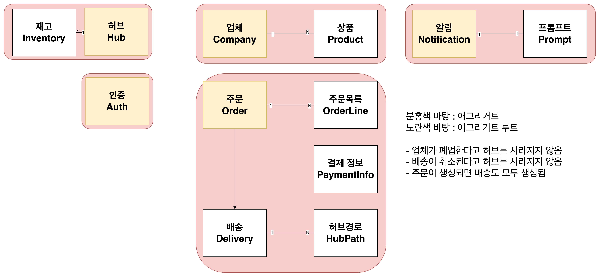
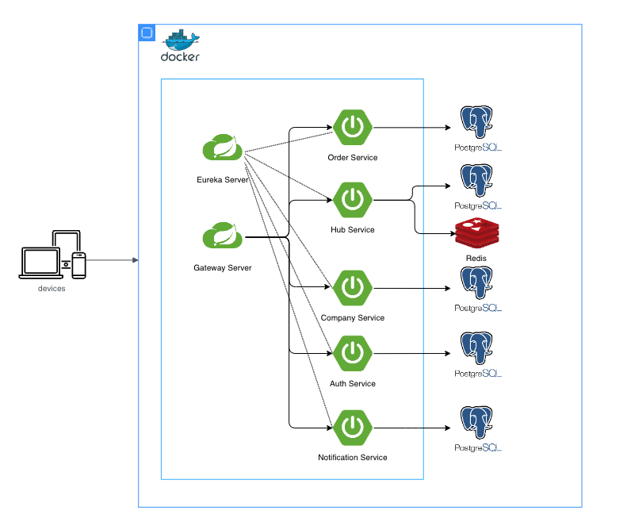

# 🐿 animal-logistics

> 👊 Ch.4 동물농장 팀 (9조) - 물류 서비스 프로젝트

## 목차

- [🐥 컨벤션 가이드](#-컨벤션-가이드)
- [🐒 구성원](#-구성원)
- [🐸 실행 방법](#-실행-방법)
- [🐹 개발 환경](#-개발-환경)
- [👻 상세 개발 환경](#-상세-개발-환경)
- [🐰 프로젝트 상세](#-프로젝트-상세)
- [🐳 ERD](#-erd)
- [🐙 API docs](#-api-docs)
- [🐬 인프라 구조](#-인프라-구조)

## 🐥 컨벤션 가이드

- [여기](./conventions)를 참고해주세요.

## 🐒 구성원

| 이름                                  | 역할 분담                   |
|-------------------------------------|-------------------------|
| [김재윤](https://github.com/yunjae62) | 허브 관리, 허브 배송, 인프라       |
| [박주창](https://github.com/joo-chang) | 업체 관리, 업체 배송, 외부 API 연동          |
| [윤선미](https://github.com/hgalchi)   | 인증 및 인가, 주문 관리 |

## 🐸 실행 방법

1. 아래의 환경 변수 설정
    ```dotenv
   # application의 order 모듈에서 사용하는 환경변수 입니다. 
   WEATHER_KEY
   GEMINI_KEY
    ```
    - `구성 편집` -> `빌드 및 실행` -> `옵션 수정` -> `환경 변수` 선택 -> 환경 변수에 아래의 형식으로 작성
    - `WEATHER_KEY=값1;WEATHER_KEY=값2`
2. 도커 실행
3. 각 애플리케이션 모듈의 스프링 실행
    - `docker compose support` 라이브러리가 자동으로 컨테이너를 실행 및 종료합니다.

### 🦆 엔드포인트 (스웨거 UI)

1. [게이트웨이](http://localhost:8080)
2. [허브](http://localhost:8081/swagger-ui/index.html)
3. [주문](http://localhost:8082/swagger-ui/index.html)
4. [업체](http://localhost:8083/swagger-ui/index.html)
5. [인증](http://localhost:8084/swagger-ui/index.html)
6. [알림](http://localhost:8085/swagger-ui/index.html)
7. [유레카](http://localhost:19090/swagger-ui/index.html)

## 🐹 개발 환경

| 분류         | 상세                          |
|------------|:----------------------------|
| IDE        | IntelliJ                    |
| Language   | Java 17                     |
| Framework  | Spring Boot 3.3.3           |
| Repository | PostgreSQL 16.4, Redis 7.4  |
| Build Tool | Gradle 8.8                  |
| Infra      | EC2, Docker, Github Actions |

## 👻 상세 개발 환경

### Dependencies

- Spring WebMVC
- Spring Validation
- Spring Security
- Spring Data Jpa
- Spring Data Redis
- Eureka
- Openfeign
- Actuator
- jjwt 0.12.6
- QueryDSL 5.0.0
- mapStruct 1.5.5.Final
- Lombok
- JUnit
- Swagger 2.6.0
- Jacoco

## 🐰 프로젝트 상세

### 이벤트 스토밍 및 도메인 주도 설계




### HTTP 파일로 API 테스트 자동화

- [HUB HTTP 테스트](./application/hub/http/hub-api.http)

### 도커 컴포즈 서포트

- 도커 컴포즈 서포트를 활용하여 팀원 간 환경 설정 통일

## 🐳 ERD


- [ErdCloud](https://www.erdcloud.com/d/3PmxD7wzwzgkzgrib)

## 🐙 API docs

## 🐬 인프라 구조


